# MVP — Pipeline de Dados na Nuvem: E-commerce Olist

**Disciplina:** Engenharia de Dados — PUC-Rio
**Aluno:** Nestor AntonioPalacios
**Plataforma:** Databricks Free Edition

---

## Sumário

1. [Contexto de Negócios e Perguntas (Etapa 2 e 4.1)](#contexto-de-negócios-e-perguntas-etapa-2-e-41)
2. [Carga dos Dados (Etapa 4.2)](#carga-dos-dados-etapa-42)
3. [Modelagem e Catálogo de Dados (Etapa 4.3)](#modelagem-e-catálogo-de-dados-etapa-43)
4. [Pipeline de Dados (Etapa 4.4)](#pipeline-de-dados-etapa-44)
5. [Qualidade de Dados (Etapa 4.5)](#qualidade-de-dados-etapa-45)
6. [Análise de Dados (Etapa 4.5)](#análise-de-dados-etapa-45)
7. [Autoavaliação](#autoavaliação)

### Estrutura do repositório

| Notebook | Responsabilidade |
|---|---|
| [MVP00-objetivo](MVP00-objetivo.ipynb) | Problema e perguntas de negócio |
| [MVP01-setup](MVP01-setup.ipynb) | Catálogo, schemas e volume |
| [MVP02-carga-staging](MVP02-carga-staging.ipynb) | Verificação dos arquivos brutos |
| [MVP03-modelagem](MVP03-modelagem.ipynb) | Modelo dimensional e catálogo de dados |
| [MVP04-bronce](MVP04-bronce.ipynb) | Ingestão para a camada Bronze |
| [MVP05-qualidade](MVP05-qualidade.ipynb) | Diagnóstico de qualidade |
| [MVP06-silver](MVP06-silver.ipynb) | Limpeza e padronização |
| [MVP07-gold](MVP07-gold.ipynb) | Materialização do modelo estrela |
| [MVP08-analise](MVP08-analise.ipynb) | Respostas às perguntas de negócio |
| `Images/` | Evidências (screenshots) |

---

## Contexto de Negócios e Perguntas (Etapa 2 e 4.1)

### Problema

Marketplaces de e-commerce intermedeiam milhares de vendedores independentes, mas não controlam diretamente a
operação logística de cada um. Isso gera uma pergunta central para o negócio: **quais fatores logísticos,
geográficos e comerciais explicam a satisfação do cliente e a concentração de receita?**

Responder a isso permite decidir onde agir: renegociar prazos de entrega, revisar a curadoria de categorias
problemáticas ou reduzir a dependência de poucos vendedores.

### Perguntas de negócio

1. Quanto varia a nota média da avaliação quando o pedido é entregue após a data estimada, quando o efeito se torna severo?
2. Quais estados concentram os maiores prazos de entrega e qual o peso do frete sobre o valor do pedido em cada um?
3. Pedidos interestaduais (vendedor e cliente em estados diferentes) demoram significativamente mais que os intraestaduais?
4. Quais categorias concentram a receita e quais combinam alto volume com avaliações baixas?
5. Como evoluíram a receita mensal e o ticket médio entre os anos 2017 e 2018?
6. O pagamento parcelado está relacionado ao tickets mais altos? Qual o meio de pagamento mais frecuente?
7. A receita está distribuída de forma equilibrada entre os vendedores ou concentrada em poucos participantes com elevada representatividade no faturamento?

> As perguntas foram definidas antes da coleta e não foram alteradas. A [Autoavaliação](#autoavaliação) discute o que foi e o que não foi possível responder.

### Fonte e contexto dos dados brutos

**Brazilian E-Commerce Public Dataset by Olist**, publicado no Kaggle. Contém
pedidos reais e anonimizados feitos na Olist, plataforma que conecta pequenos varejistas a grandes marketplaces brasileiros, entre setembro de 2016 e outubro de 2018. Os meses das extremidades têm volume residual.

### Licença

- **Licença: CC BY-NC-SA 4.0** — uso não comercial, com atribuição à Olist e obrigação de compartilhar derivados sob a mesma licença. Por se tratar de um trabalho estritamente acadêmico, seu uso está em conformidade com os termos da licença.

### Estrutura dos dados brutos

Nove arquivos CSV relacionados por chaves:

| Arquivo | Linhas | Grão | Colunas |
|---|---|---|---|
| `olist_orders_dataset.csv` | 99.441 | um pedido | order_id, customer_id, order_status, order_purchase_timestamp, order_approved_at, order_delivered_carrier_date, order_delivered_customer_date, order_estimated_delivery_date |
| `olist_order_items_dataset.csv` | 112.650 | um item de pedido | order_id, order_item_id, product_id, seller_id, shipping_limit_date, price, freight_value |
| `olist_order_payments_dataset.csv` | 103.886 | uma transação de pagamento | order_id, payment_sequential, payment_type, payment_installments, payment_value |
| `olist_order_reviews_dataset.csv` | 99.224 | uma avaliação | review_id, order_id, review_score, review_comment_title, review_comment_message, review_creation_date, review_answer_timestamp |
| `olist_customers_dataset.csv` | 99.441 | um cliente por pedido | customer_id, customer_unique_id, customer_zip_code_prefix, customer_city, customer_state |
| `olist_sellers_dataset.csv` | 3.095 | um vendedor | seller_id, seller_zip_code_prefix, seller_city, seller_state |
| `olist_products_dataset.csv` | 32.951 | um produto | product_id, product_category_name, product_name_lenght, product_description_lenght, product_photos_qty, product_weight_g, product_length_cm, product_height_cm, product_width_cm |
| `olist_geolocation_dataset.csv` | 1.000.163 | um ponto lat/lng | geolocation_zip_code_prefix, geolocation_lat, geolocation_lng, geolocation_city, geolocation_state |
| `product_category_name_translation.csv` | 71 | uma categoria | product_category_name, product_category_name_english |

Relações principais: `orders` é o centro; `order_items`, `order_payments` e `order_reviews` se ligam por `order_id`;
`orders` se liga a `customers` por `customer_id`; `order_items` se liga a `products` e `sellers`.

Dois detalhes relevantes da origem: `customer_id` muda a cada compra (a pessoa é identificada por
`customer_unique_id`), e as avaliações existem por pedido, não por item.

---

## Carga dos Dados (Etapa 4.2)

### Como foi feita

1. Download manual dos 9 arquivos CSV a partir da página do dataset no Kaggle.
2. Criação da estrutura no Unity Catalog ([MVP01-setup](MVP01-setup.ipynb)): catálogo `mvp`,
   schemas `staging`, `bronce`, `silver`, `gold` e o volume `mvp.staging.kaggle_raw`.
3. Upload dos arquivos para o volume pelo Catalog Explorer (*Upload to this volume*).
4. Verificação automatizada ([MVP02-carga-staging](MVP02-carga-staging.ipynb)): inventário, checagem de que os 9 arquivos esperados estão presentes e leitura dos cabeçalhos.

### Decisões

- **Volume do Unity Catalog em vez de DBFS:** o volume é governado pelo catálogo, com controle de acesso e linhagem rastreável.
- **Staging separada da Bronze:** `staging` guarda os **arquivos** exatamente como baixados; `bronce` guarda as **tabelas Delta** desses arquivos. Assim a origem física permanece intacta e reprocessável.

- **Carga manual em vez de API:** o dataset é estático (sem atualização a automatizar) e foi mais pratico para o projeto. 

### Evidências
- Volume de staging com os 9 arquivos
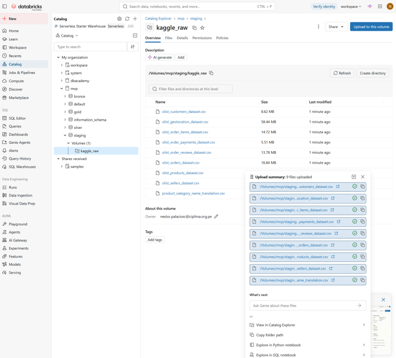

- Schemas do catálogo mvp
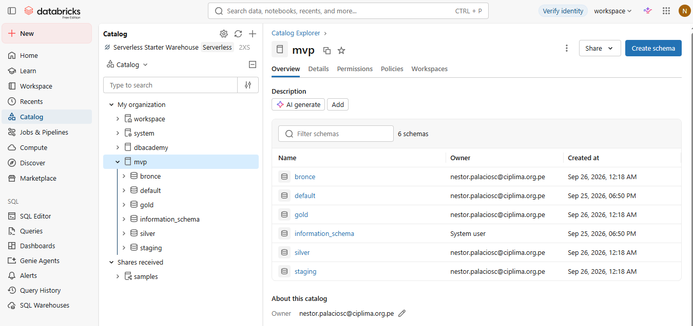

---

## Modelagem e Catálogo de Dados (Etapa 4.3)

Notebook: [MVP03-modelagem](MVP03-modelagem.ipynb)

### Arquitetura em camadas (medalhão)

| Camada | Local | Conteúdo | Responsabilidade |
|---|---|---|---|
| Staging | `mvp.staging.kaggle_raw` | 9 arquivos CSV | Aterrissagem dos arquivos originais |
| Bronze | `mvp.bronce` | 9 tabelas Delta | Cópia fiel, todas as colunas STRING, sem tratamento |
| Silver | `mvp.silver` | 7 tabelas Delta | Dados tipados, padronizados e deduplicados |
| Gold | `mvp.gold` | 6 tabelas Delta | Modelo dimensional para consumo analítico |

### Modelo dimensional adotado

**Esquema estrela** na camada Gold, com duas tabelas de fato de grãos diferentes e quatro dimensões.

Decisões de modelagem:

1. **Esquema estrela:** as perguntas são analíticas (agregações por estado, categoria, mês, vendedor), cenário para o qual o modelo estrela é otimizado.
2. **Duas fatos com grãos distintos.** `fato_pedidos` (um pedido) responde às perguntas 1, 2, 3, 5 e 6; `fato_itens_pedido` (um item) responde às perguntas 4 e 7. Uma única fato no grão de item faria a nota da avaliação, que existe por pedido, se repetir em cada item, inflando o peso de pedidos com vários itens nas médias.
3. **Dimensões conformadas:** `dim_cliente` e `dim_tempo` são compartilhadas pelas duas fatos, garantindo que cortes por cliente e por data sejam consistentes entre elas.
4. **Chaves naturais:** os identificadores da Olist já são hashes únicos e estáveis; chaves substitutas adicionariam complexidade sem ganho neste escopo.
5. **Geolocalização fora da Gold:** todas as perguntas geográficas são respondidas no nível de UF, já presente em clientes e vendedores; a tabela de geolocalização (~1 milhão de linhas, múltiplas coordenadas por CEP) permanece apenas na Bronze.
6. **Tradução de categorias incorporada à dimensão produto**, evitando um snowflake desnecessário.

### Diagrama do modelo

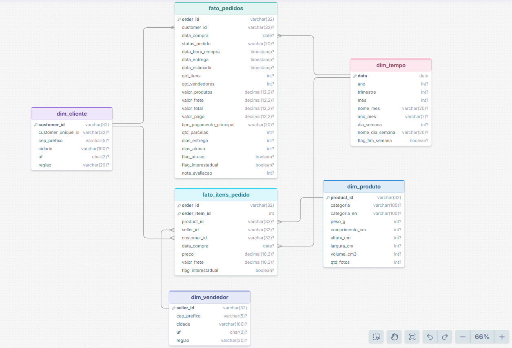

As linhas representam relações um-para-muitos, com o lado "muitos" nas tabelas de fato.

### Rastreabilidade: pergunta → tabelas

| Pergunta | Fato | Dimensões |
|---|---|---|
| 1. Atraso × nota | fato_pedidos | — |
| 2. Prazo e frete por UF | fato_pedidos | dim_cliente |
| 3. Interestadual × intraestadual | fato_pedidos | — |
| 4. Receita e nota por categoria | fato_itens_pedido + fato_pedidos | dim_produto |
| 5. Evolução mensal | fato_pedidos | dim_tempo |
| 6. Parcelamento × ticket | fato_pedidos | — |
| 7. Concentração de vendedores | fato_itens_pedido | dim_vendedor |

### Catálogo de dados — camada Gold

As descrições abaixo estão registradas como comentários de tabela e de coluna no Unity Catalog.
Os domínios observados foram confirmados na validação 5 do [MVP07-gold](MVP07-gold.ipynb).

#### `mvp.gold.fato_pedidos`
Fato de pedidos. **Grão:** um pedido. **Linhagem:** silver.pedidos + silver.itens_pedido + silver.pagamentos + silver.avaliacoes.

| Campo | Tipo | Descrição | Domínio | Linhagem |
|---|---|---|---|---|
| order_id | STRING | Identificador do pedido (PK) | hash de 32 caracteres | orders.order_id |
| customer_id | STRING | Cliente do pedido (FK → dim_cliente) | hash de 32 caracteres | orders.customer_id |
| data_compra | DATE | Data da compra (FK → dim_tempo) | 2016-09-04 a 2018-10-17 | orders.order_purchase_timestamp |
| status_pedido | STRING | Status do pedido | delivered, shipped, canceled, unavailable, invoiced, processing, created, approved | orders.order_status |
| data_hora_compra | TIMESTAMP | Momento da compra | — | orders.order_purchase_timestamp |
| data_entrega | TIMESTAMP | Entrega ao cliente; nulo se não entregue | — | orders.order_delivered_customer_date |
| data_estimada | TIMESTAMP | Data de entrega prometida | — | orders.order_estimated_delivery_date |
| qtd_itens | INT | Número de itens do pedido | 1 a 21; nulo se pedido sem itens | COUNT em order_items |
| qtd_vendedores | INT | Vendedores distintos no pedido | ≥ 1 | COUNT DISTINCT seller_id em order_items |
| valor_produtos | DECIMAL(12,2) | Soma dos preços dos itens (BRL) | ≥ 0 | SUM(order_items.price) |
| valor_frete | DECIMAL(12,2) | Soma dos fretes (BRL) | ≥ 0 | SUM(order_items.freight_value) |
| valor_total | DECIMAL(12,2) | valor_produtos + valor_frete (BRL) | R$ 9,59 a R$ 13.664,08; nulo se pedido sem itens | Derivado |
| valor_pago | DECIMAL(12,2) | Total efetivamente pago (BRL) | ≥ 0 | SUM(order_payments.payment_value) |
| tipo_pagamento_principal | STRING | Meio de pagamento de maior valor | credit_card, boleto, voucher, debit_card | max_by em order_payments, ignorando not_defined |
| qtd_parcelas | INT | Maior número de parcelas do pedido | 1 a 24 | MAX(order_payments.payment_installments), parcelas < 1 → 1 |
| dias_entrega | INT | Dias entre compra e entrega; nulo se entrega inválida | 0 a 210 | datediff(data_entrega, data_hora_compra) |
| dias_atraso | INT | Dias entre entrega real e estimada; negativo = antecipado | -147 a 188 | datediff(data_entrega, data_estimada) |
| flag_atraso | BOOLEAN | Verdadeiro se dias_atraso > 0 | true, false, nulo | Derivado |
| flag_interestadual | BOOLEAN | Ao menos um vendedor em UF diferente da do cliente | true, false, nulo | sellers.seller_state × customers.customer_state |
| nota_avaliacao | INT | Nota da avaliação; nulo se não avaliado | 1 a 5 | order_reviews.review_score (mais recente por pedido) |

#### `mvp.gold.fato_itens_pedido`
Fato de itens. **Grão:** um item de pedido. **Linhagem:** silver.itens_pedido + silver.pedidos + silver.clientes + silver.vendedores.

| Campo | Tipo | Descrição | Domínio | Linhagem |
|---|---|---|---|---|
| order_id | STRING | Pedido (parte da PK) | hash de 32 caracteres | order_items.order_id |
| order_item_id | INT | Sequencial do item no pedido (parte da PK) | ≥ 1 | order_items.order_item_id |
| product_id | STRING | Produto (FK → dim_produto) | hash de 32 caracteres | order_items.product_id |
| seller_id | STRING | Vendedor (FK → dim_vendedor) | hash de 32 caracteres | order_items.seller_id |
| customer_id | STRING | Cliente (FK → dim_cliente), herdado do pedido | hash de 32 caracteres | orders.customer_id |
| data_compra | DATE | Data da compra (FK → dim_tempo), herdada do pedido | 2016-09-04 a 2018-10-17 | orders.order_purchase_timestamp |
| preco | DECIMAL(10,2) | Preço do item (BRL) | > 0 | order_items.price |
| valor_frete | DECIMAL(10,2) | Frete do item (BRL) | ≥ 0 | order_items.freight_value |
| flag_interestadual | BOOLEAN | UF do vendedor diferente da UF do cliente | true, false, nulo | sellers × customers |

#### `mvp.gold.dim_cliente`
Dimensão cliente. **Grão:** um customer_id. **Linhagem:** bronce.customers → silver.clientes.

| Campo | Tipo | Descrição | Domínio | Linhagem |
|---|---|---|---|---|
| customer_id | STRING | Identificador do cliente no pedido (PK) | hash de 32 caracteres | customers.customer_id |
| customer_unique_id | STRING | Identificador estável da pessoa | hash de 32 caracteres | customers.customer_unique_id |
| cep_prefixo | STRING | 5 primeiros dígitos do CEP | 5 dígitos | customers.customer_zip_code_prefix |
| cidade | STRING | Cidade padronizada | texto sem acentos, capitalizado | customers.customer_city |
| uf | STRING | Sigla do estado | 27 UFs | customers.customer_state |
| regiao | STRING | Região derivada da UF | Norte, Nordeste, Centro-Oeste, Sudeste, Sul | Tabela de referência UF → região |

#### `mvp.gold.dim_vendedor`
Dimensão vendedor. **Grão:** um vendedor. **Linhagem:** bronce.sellers → silver.vendedores.

| Campo | Tipo | Descrição | Domínio | Linhagem |
|---|---|---|---|---|
| seller_id | STRING | Identificador do vendedor (PK) | hash de 32 caracteres | sellers.seller_id |
| cep_prefixo | STRING | 5 primeiros dígitos do CEP | 5 dígitos | sellers.seller_zip_code_prefix |
| cidade | STRING | Cidade padronizada | texto sem acentos, capitalizado | sellers.seller_city |
| uf | STRING | Sigla do estado | 27 UFs | sellers.seller_state |
| regiao | STRING | Região derivada da UF | Norte, Nordeste, Centro-Oeste, Sudeste, Sul | Tabela de referência UF → região |

#### `mvp.gold.dim_produto`
Dimensão produto. **Grão:** um produto. **Linhagem:** bronce.products + bronce.category_translation → silver.produtos.

| Campo | Tipo | Descrição | Domínio | Linhagem |
|---|---|---|---|---|
| product_id | STRING | Identificador do produto (PK) | hash de 32 caracteres | products.product_id |
| categoria | STRING | Categoria em português | 73 categorias de origem + sem_categoria | products.product_category_name |
| categoria_en | STRING | Categoria em inglês | fallback para português se sem tradução | category_translation |
| peso_g | INT | Peso em gramas | > 0 ou nulo | products.product_weight_g |
| comprimento_cm | INT | Comprimento em cm | > 0 ou nulo | products.product_length_cm |
| altura_cm | INT | Altura em cm | > 0 ou nulo | products.product_height_cm |
| largura_cm | INT | Largura em cm | > 0 ou nulo | products.product_width_cm |
| volume_cm3 | INT | Comprimento × altura × largura | > 0 ou nulo | Derivado |
| qtd_fotos | INT | Fotos no anúncio | ≥ 0 | products.product_photos_qty |

#### `mvp.gold.dim_tempo`
Dimensão calendário. **Grão:** um dia. **Linhagem:** gerada por sequência de datas cobrindo o período das compras.

| Campo | Tipo | Descrição | Domínio |
|---|---|---|---|
| data | DATE | Data (PK) | 2016-09-01 a 2018-10-31 (meses completos do período) |
| ano | INT | Ano | 2016 a 2018 |
| trimestre | INT | Trimestre | 1 a 4 |
| mes | INT | Mês | 1 a 12 |
| nome_mes | STRING | Nome do mês | janeiro a dezembro |
| ano_mes | STRING | Ano-mês (AAAA-MM) | — |
| dia_semana | INT | Dia da semana | 1 (domingo) a 7 (sábado) |
| nome_dia_semana | STRING | Nome do dia | domingo a sábado |
| flag_fim_semana | BOOLEAN | Sábado ou domingo | true, false |

### Catálogo — camadas Bronze e Silver (nível de tabela)

| Tabela | Descrição |
|---|---|
| `bronce.*` (9 tabelas) | Cópia fiel de cada CSV; todas as colunas STRING; colunas de controle `_data_ingestao`, `_arquivo_origem`, `_fonte` |
| `silver.pedidos` | Pedidos tipados; `flag_entrega_valida` isola entregas utilizáveis nas métricas de prazo |
| `silver.itens_pedido` | Itens tipados (preço e frete em DECIMAL) |
| `silver.pagamentos` | Pagamentos tipados; parcelas < 1 convertidas para 1 |
| `silver.avaliacoes` | Uma avaliação por pedido (a mais recente) |
| `silver.clientes` / `silver.vendedores` | Cidade padronizada, UF e CEP normalizados |
| `silver.produtos` | Categoria tratada e traduzida; medidas inválidas anuladas |

### Evidências do Unity Catalog
- Comentários das colunas no Catalog Explorer
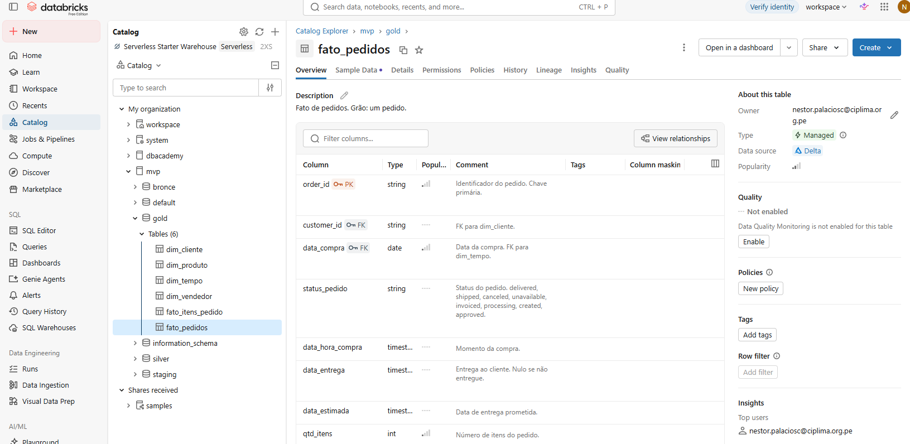

- Relacionamentos das tabelas Gold
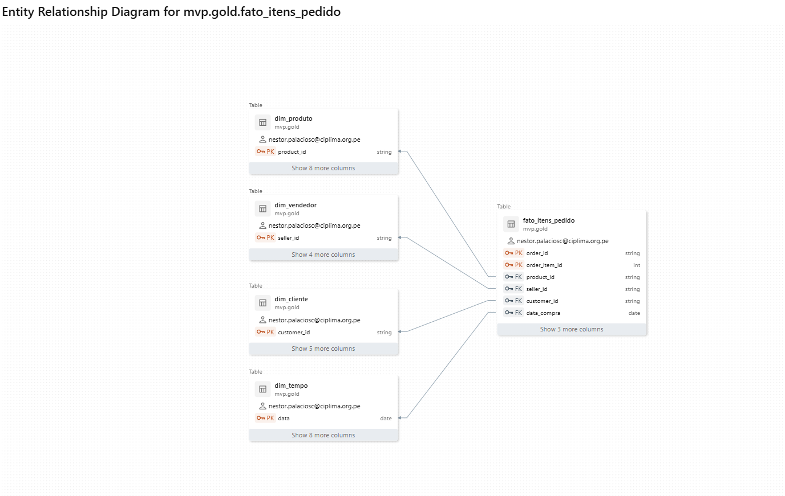

- Linhagem bronze → silver → gold
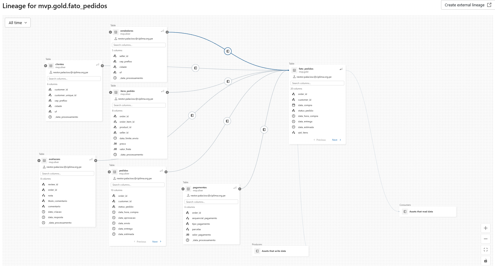

---

## Pipeline de Dados (Etapa 4.4)

### Organização

O pipeline foi **ramificado em um notebook por etapa**, e cada notebook lê apenas da camada anterior e escreve
apenas na seguinte. Isso isola responsabilidades, facilita reprocessar uma etapa sem executar as demais e deixa
a linhagem explícita.

```
Kaggle (CSV) ──► staging (volume) ──► bronce (Delta, STRING) ──► silver (Delta, tipado) ──► gold (estrela)
               MVP02                  MVP04                      MVP06                       MVP07
                                              │
                                              └──► MVP05 (diagnóstico de qualidade)
```

| Etapa | Notebook | Lê de | Escreve em | Transformações principais |
|---|---|---|---|---|
| Setup | MVP01 | — | catálogo, schemas, volume | Criação idempotente da estrutura |
| Staging | MVP02 | volume | — | Verificação dos 9 arquivos |
| Modelagem | MVP03 | — | `gold` (tabelas vazias) | Esquema, comentários, PK e FK |
| Bronze | MVP04 | `staging` | `bronce` | Leitura CSV como STRING + colunas de controle |
| Qualidade | MVP05 | `bronce` | — | Diagnóstico (não altera dados) |
| Silver | MVP06 | `bronce` | `silver` | Tipagem, padronização, deduplicação, tradução |
| Gold | MVP07 | `silver` | `gold` | Agregações, flags derivadas, enriquecimento por região |
| Análise | MVP08 | `gold` | — | Consultas das perguntas de negócio |

### Principais transformações documentadas

- **Bronze:** leitura com `multiLine` e `escape` para suportar quebras de linha e aspas nos comentários de avaliação; `inferSchema` desativado para não perder valores malformados na ingestão.
- **Silver:** conversões com `try_cast` (o compute serverless opera em modo ANSI, no qual um cast inválido gera erro); deduplicação de avaliações com `row_number()` por pedido; padronização de cidades com remoção de acentos; join de produtos com a tabela de tradução.
- **Gold:** `fato_pedidos` consolida três agregações (itens, pagamentos e avaliação) por `LEFT JOIN`, preservando todos os pedidos; `max_by` define o meio de pagamento principal; métricas de prazo só são calculadas para entregas válidas. As tabelas são preenchidas com `INSERT OVERWRITE`, que preserva o esquema, os comentários e as chaves definidos no MVP03.

### Validações embutidas no pipeline

| Notebook | Validação |
|---|---|
| MVP02 | Presença dos 9 arquivos esperados (`assert`) |
| MVP04 | Contagem carregada × contagem publicada do dataset |
| MVP06 | Conservação de linhas Bronze × Silver; regras aplicadas (zeros esperados) |
| MVP07 | Unicidade das PKs; integridade referencial; reconciliação da receita entre Silver e Gold |

### Evidências de persistência

- Validação de contagem na Bronze
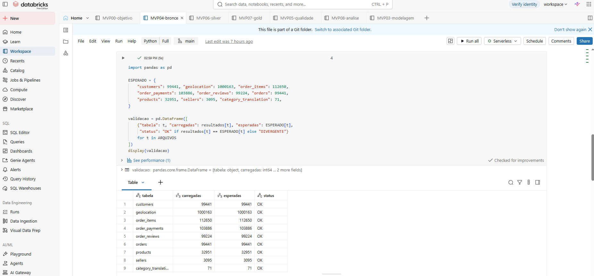

- Bronze com todas as colunas STRING
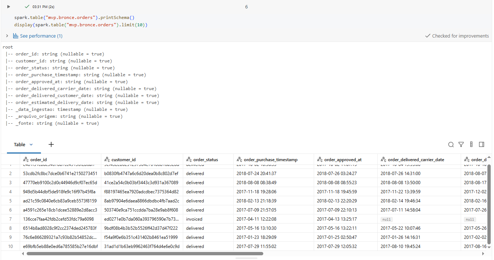

- Tabelas persistidas nas camadas
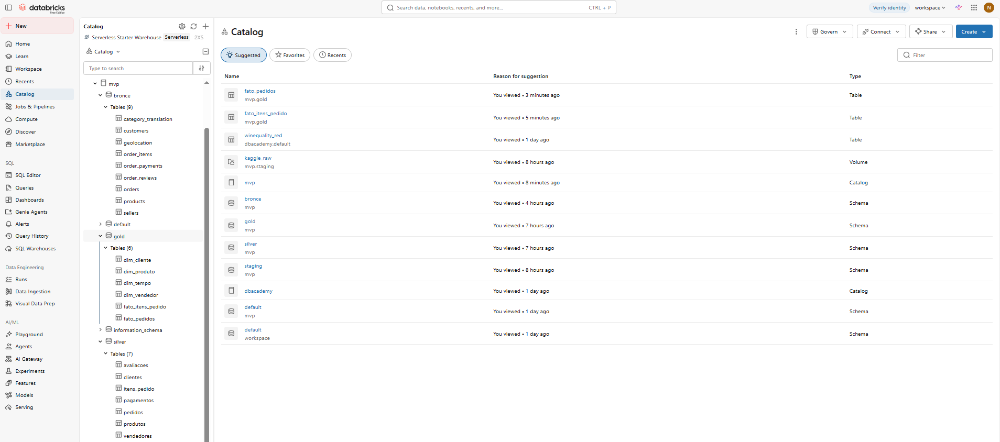

- Validações da Gold
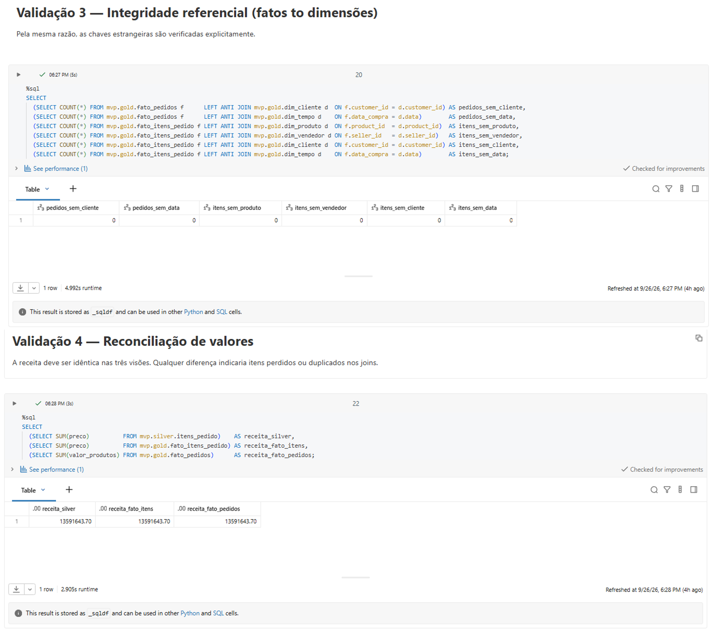

---

## Qualidade de Dados (Etapa 4.5)

Notebook de diagnóstico: [MVP05-qualidade](MVP05-qualidade.ipynb) · Notebook de tratamento: [MVP06-silver](MVP06-silver.ipynb)

### Método

O diagnóstico foi feito **sobre a Bronze**, antes de qualquer tratamento, nas dimensões de completude,
unicidade, consistência (tipos e domínios), integridade referencial, acurácia (coerência temporal) e outliers
(critério IQR). Cada problema encontrado gerou uma regra explícita na Silver.

### Achados e tratamentos

| # | Tabela | Dimensão | Achado | Afetado | Tratamento |
|---|---|---|---|---|---|
| 1 | orders | Completude | `order_delivered_customer_date` nulo | 2.98% | Mantido nulo (pedido não entregue); fora das métricas de prazo |
| 2 | orders | Acurácia | Status `delivered` sem data de entrega | 8 linhas | Mantido; `flag_entrega_valida = false` |
| 3 | orders | Acurácia | Meses de borda com volume residual | 4 meses | Mantidos na Silver; excluídos da série temporal (P5) |
| 4 | order_reviews | Unicidade | Pedidos com mais de uma avaliação | 547 pedidos | Mantida a mais recente por pedido |
| 5 | order_reviews | Completude | Título e comentário vazios | 88.34% (título) e 58.71% (comentário) | Esperado (campos opcionais); vazios → nulo |
| 6 | products | Completude | Categoria nula | 610 produtos | Substituída por `sem_categoria` |
| 7 | products | Consistência | Categorias sem tradução | 2 categorias | `categoria_en` recebe o nome em português |
| 8 | products | Acurácia | Peso/dimensões nulos ou zero | 8 produtos com medidas nulas e 4 com peso zero | Zero → nulo; volume só com medidas completas |
| 9 | customers/sellers | Consistência | Grafias divergentes de cidade | 4119 → 4119 (nenhuma variação por maiúsculas/espaços) | Padronização aplicada de forma preventiva: remoção de acentos, trim e capitalização |
| 10 | order_payments | Consistência | `payment_type = not_defined` | 3 linhas | Mantido; ignorado na escolha do meio principal |
| 11 | order_payments | Consistência | Parcelas = 0 | 2 linhas | Convertido para 1 (pagamento à vista) |
| 12 | orders × items | Integridade | Pedidos sem itens | 775 pedidos | Mantidos com valores nulos; fora das análises de receita |
| 13 | geolocation | Unicidade | Múltiplas coordenadas por CEP | 981.148 linhas duplicadas por CEP (98.1%) | Esperado pela natureza da tabela; fora do modelo Gold (olhar MVP03) |
| 14 | order_items | Outliers | Preços acima do limite IQR | 7.48% | Mantidos (valores legítimos); mediana usada quando pertinente |


### Evidências

- Qualidade completude

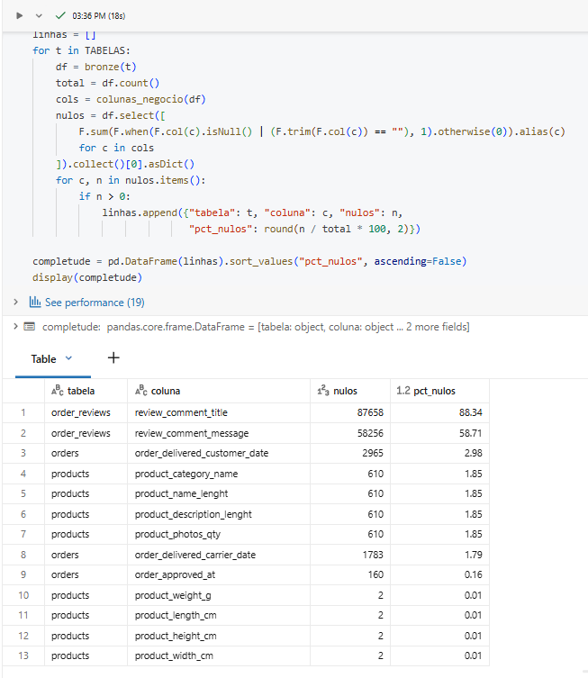

- Qualidade unicidade
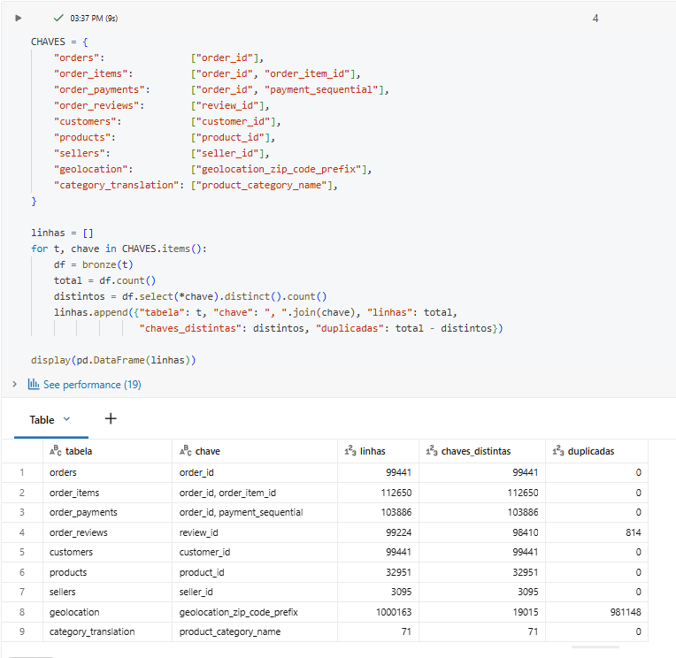

- Qualidade integridade
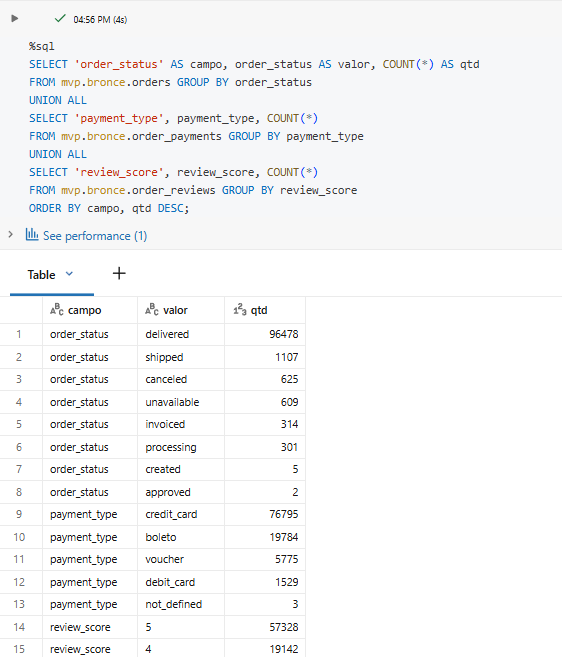

- Qualidade outliers
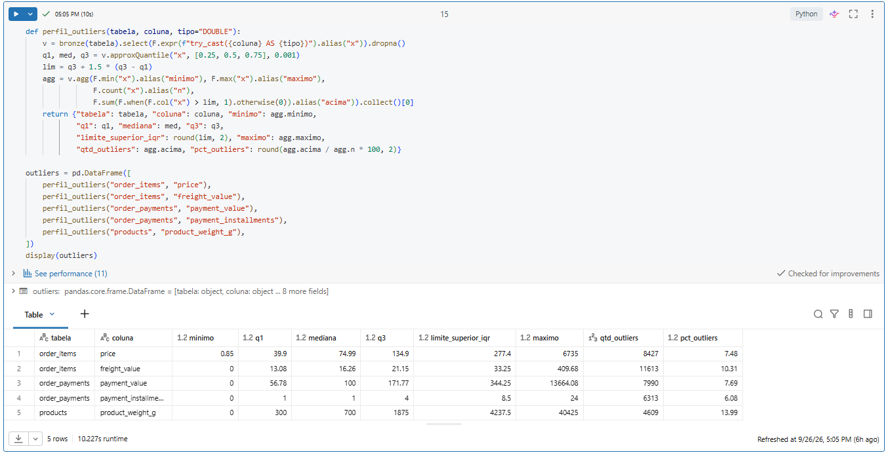

- Validacao Silver
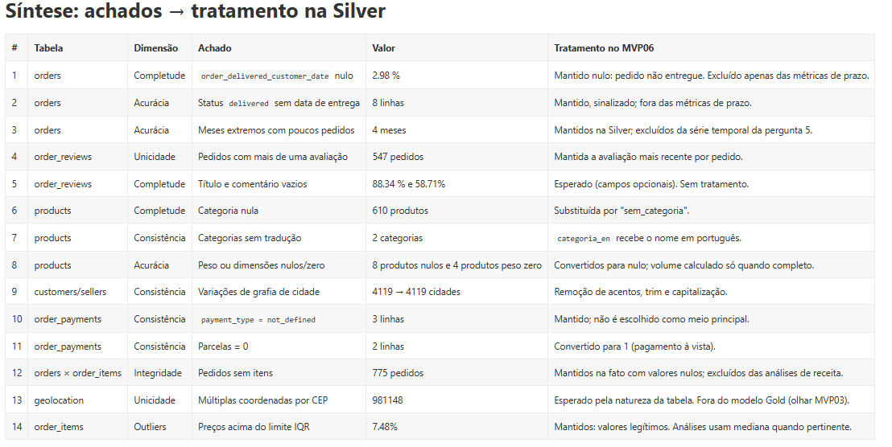

---

## Análise de Dados (Etapa 4.5)

Notebook: [MVP08-analise](MVP08-analise.ipynb). Todas as consultas usam exclusivamente a camada Gold.

### Pergunta 1 — Atraso × nota da avaliação

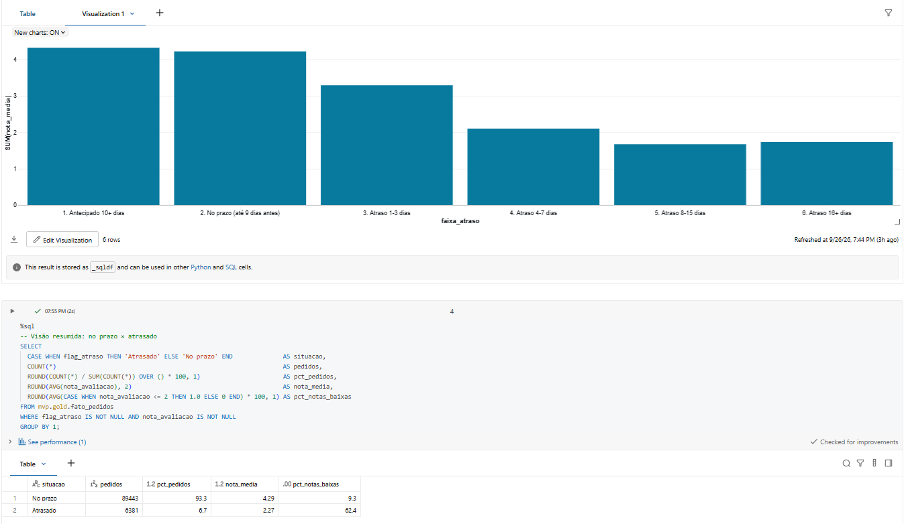

Pedidos entregues no prazo têm nota média de **4.29**, contra **2.27** nos atrasados (queda de **2.02** pontos).
O percentual de notas baixas passa de **9.3 %** para **62.4 %**. O efeito se torna severo a partir da faixa **"4. Atraso 4-7 dias"**,
onde **As notas baixas representam mais de 50% dos casos, e a nota média é inferior a 3. Além disso, a quantidade de pedidos é semelhante entre as faixas mais próximas**.

### Pergunta 2 — Prazo e frete por estado

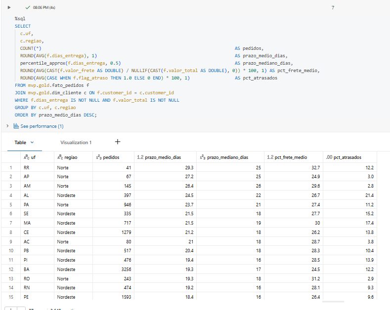

- Os maiores prazos estão em **RR**, com média de **29.3 dias**, contra **8.7 dias** em **SP**.
- Nessas UFs o frete representa **28.3%** do valor do pedido, contra **19.5%** no Sudeste.
- Os clientes do Norte esperam mais que os do Sudeste, mas a quantidade do pedidos no Sudeste e bem maior do que Norte.

### Pergunta 3 — Interestadual × intraestadual

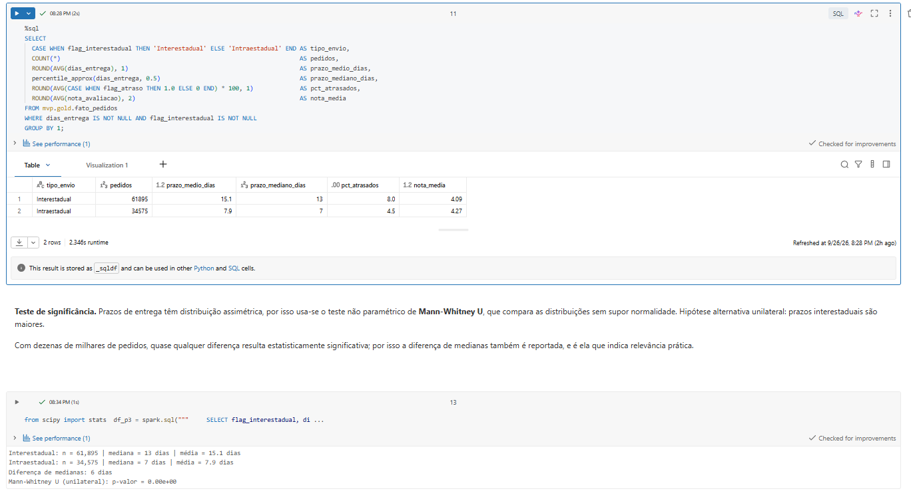

Pedidos interestaduais levam em mediana **13 dias**, contra **7 dias** nos intraestaduais (diferença de **6 dias**). O teste de Mann-Whitney resultou em p-valor **<0.001**, portanto a diferença **é** estatisticamente significativa. Como amostras grandes tornam significativas até diferenças mínimas, a relevância foi avaliada também pelo tamanho do efeito: seis dias a mais na mediana é uma diferença de grande impacto prático.

### Pergunta 4 — Receita e avaliação por categoria

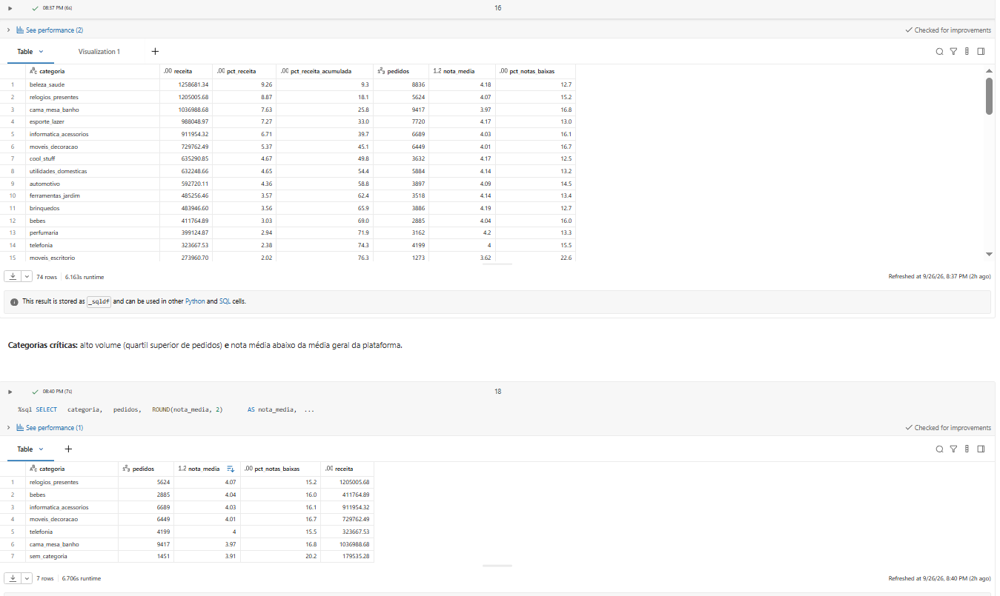

As **8** maiores categorias concentram **54.4 %** da receita, lideradas por **beleza_saude** (**9.26 %**).
Entre as categorias de alto volume, **7 categorias (relogios_presentes, bebes, informatica_acessorios, moveis_decoracao, telefonia, cama_mesa_banho e sem_categoria)** ficam abaixo da média geral de nota, com uma media simples entre as categorias do **16.64 %** de notas baixas.

### Pergunta 5 — Evolução mensal

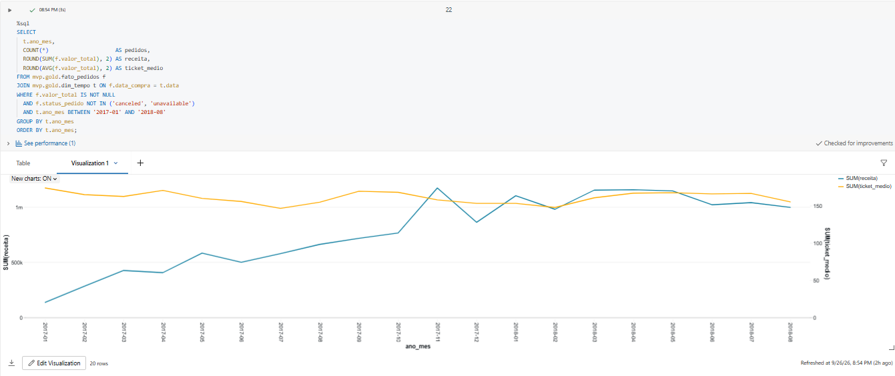

A receita mensal passou de **R$ 136943.46** em jan/2017 para **R$ 996973.51** em ago/2018. Comparando janeiro a agosto, 2018 cresceu **140.36 %** sobre 2017 em receita, enquanto o ticket médio variou **1.31 %**. Isso indica que o crescimento veio **do volume de pedidos**.
No Novembro/2017, as receitas foram as mais altas durante o período analisado.

### Pergunta 6 — Parcelamento e meios de pagamento

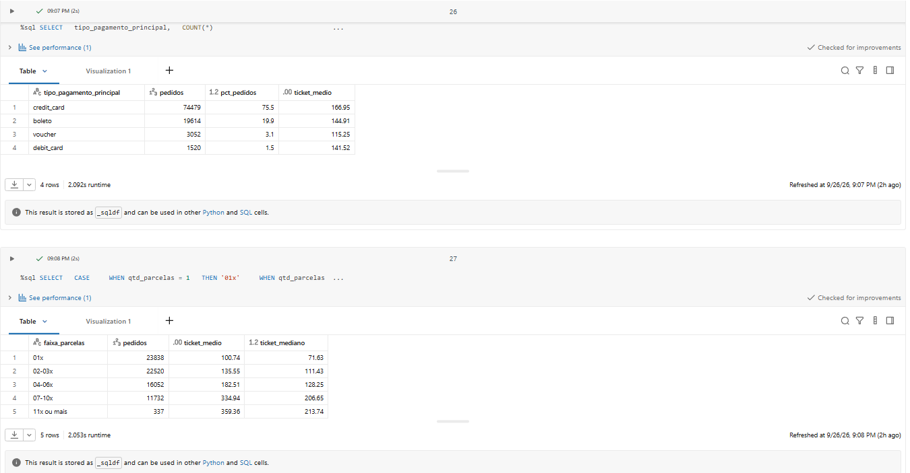

O meio dominante é **credit_card**, com **75.5 %** dos pedidos. No cartão de crédito, o ticket mediano sobe de **R$ 71.63** (à vista) para **R$ 213.74** (**faixa: 11x ou mais**). A correlação de Pearson entre parcelas e valor é **r = 0.369**, indicando associação **moderada**.
Ressalva: correlação não implica causalidade; é provável que compras caras levem ao parcelamento, e não o contrário.

### Pergunta 7 — Concentração de vendedores

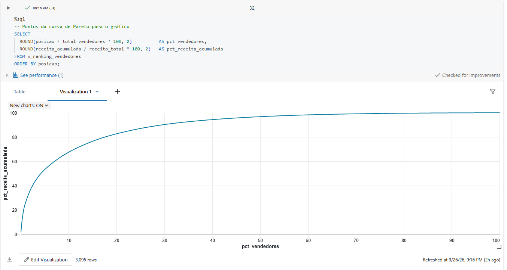

- Dos **3095** vendedores ativos, apenas **130 (4.2 %)** respondem por metade da receita, e **544 (17.6 %)** por 80%.
- A concentração é, portanto, **maior do que a sugerida pela regra 80/20**: menos de um quinto dos vendedores já gera 80% do faturamento.
- A curva sobe de forma quase vertical no início: os primeiros 4.2 % dos vendedores levam a receita acumulada a 50%. Depois ela se achata rapidamente. Os 40% maiores vendedores já acumulam **94.4 %** da receita, e a metade inferior da base, cerca de 1.500 vendedores, responde por apenas **3.2 %**.

### Discussão geral

O problema proposto era identificar quais fatores logísticos, geográficos e comerciais explicam a satisfação do cliente e a concentração de receita. As sete respostas convergem em três conclusões.

**1. A logística é o principal vetor de satisfação.** O cumprimento do prazo é o fator com maior efeito observado sobre a avaliação: a nota média cai de 4.29 para 2.27 quando o pedido atrasa, e a proporção de notas baixas sobe de 9.3% para 62.4% (P1). O dano não é gradual: a partir de 4 dias de atraso, a nota média fica abaixo de 3 e as notas baixas passam a ser maioria, o que define um limite operacional claro. Esse risco é geograficamente desigual: clientes de RR esperam em média 29.3 dias, contra 8.7 dias em SP, e nas UFs de maior prazo o frete pesa 28.3% do valor do pedido, contra 19.5% no Sudeste (P2). Parte dessa diferença se explica pela origem do envio: pedidos interestaduais levam, em mediana, 13 dias, quase o dobro dos 7 dias dos intraestaduais (P3).

**2. A receita é concentrada, sobretudo em vendedores.** Oito categorias concentram 54.4% da receita, lideradas por beleza_saude (P4). A concentração entre vendedores é ainda mais acentuada: 4.2% dos vendedores geram metade da receita e 17.6% geram 80%, acima do padrão 80/20 (P7). Entre as categorias de alto volume, sete ficam abaixo da média geral de nota, incluindo `sem_categoria`: um ponto em que a qualidade dos dados e a qualidade do serviço se encontram. Um **risco** e a saída ou a queda de desempenho de algumas dezenas de vendedores do topo teria impacto desproporcional no faturamento, por outro lado, a **oportunidade** a cauda longa, com milhares de vendedores de baixo faturamento, é um espaço de crescimento se receber apoio em visibilidade, logística e capacitação.

**3. O crescimento veio do volume, e isso pressiona a logística.** Entre janeiro e agosto, a receita de 2018 superou a de 2017 em 140.36%, enquanto o ticket médio variou apenas 1.31% (P5). O cartão de crédito domina, com 75.5% dos pedidos, e o ticket mediano cresce com o número de parcelas, com correlação moderada (P6). As conclusões se conectam: como o crescimento veio do volume, cada ponto percentual de atraso afeta um número cada vez maior de clientes. Escalar a operação sem resolver os gargalos logísticos tende a ampliar, e não diluir, o problema de satisfação.

### Considerações

- As relações observadas são **associações, não causalidade**: atraso e nota baixa podem ter causas em comum, e é
  provável que compras caras levem ao parcelamento, e não o contrário.
- UFs com poucos pedidos, como RR, têm médias menos estáveis.
- Com dezenas de milhares de pedidos, testes estatísticos detectam diferenças mínimas; por isso a relevância foi
  avaliada também pelo tamanho do efeito (diferença de medianas).
- O indicador interestadual é uma aproximação: a distância real entre vendedor e cliente não foi considerada,
  pois a geolocalização ficou fora do modelo.
- A base cobre 2016–2018, é estática, e a série temporal exclui os meses de borda com volume residual.
---

## Autoavaliação

### Contexto pessoal

Minha formação e experiência profissional vêm da **engenharia de reservatórios**, onde trabalhei com dados de produção, testes de poço, perfis e simulação de fluxos numérica 3D. Este MVP foi meu primeiro projeto completo de engenharia de dados, e boa parte do aprendizado veio justamente de traduzir para um novo domínio hábitos que eu já tinha.

Algumas pontes foram naturais. O controle de qualidade de dados de poço, em que uma medição incoerente pode comprometer todo um ajuste de histórico, tem o mesmo espírito do diagnóstico feito no MVP05: medir antes de corrigir e documentar cada decisão. 
E a arquitetura medalhão lembra o fluxo que eu já conhecia de dado bruto de campo, dado validado e dado interpretado.

Foi um processo muito interessante e enriquecedor, por meio do qual agora vou potencializar minhas habilidades no setor de óleo e gás.

### Atingimento dos objetivos

As **sete perguntas** definidas no início do trabalho foram respondidas com base na camada Gold. A pergunta 3 foi respondida com uma aproximação: a comparação entre envios interestaduais e intraestaduais substituiu o cálculo da distância real entre vendedor e cliente, que exigiria incorporar a tabela de geolocalização ao modelo. Mesmo assim, a aproximação foi suficiente para mostrar uma diferença estatisticamente significativa e de grande relevância prática.

O pipeline foi construído de ponta a ponta na nuvem (staging → bronze → silver → gold), com modelo dimensional documentado no Unity Catalog, diagnóstico de qualidade que orientou cada regra de limpeza e validações automáticas em cada camada (conservação de linhas, unicidade de chaves, integridade referencial e reconciliação de valores).

Considero que o objetivo principal foi atingido: sair de nove arquivos CSV e chegar a respostas de negócio rastreáveis, sabendo explicar de onde vem cada número.

### Dificuldades encontradas

**Um novo vocabulário e um novo ecossistema.** Conceitos como Lakehouse, Delta Lake, Unity Catalog, Spark e a arquitetura medalhão eram totalmente novos para mim. Na engenharia de reservatórios, eu trabalhava com ferramentas comerciais especializadas e com dados já organizados por fluxos definidos pela área de TI. Nesse novo contexto, precisei entender como os dados são estruturados desde a origem e qual é o propósito de cada camada da arquitetura.

**Pensar em grão e em modelo dimensional.** A maior mudança de raciocínio foi compreender o conceito de grão das tabelas. No meu contexto anterior, a hierarquia campo → reservatório → poço → completação já era estabelecida. Aqui, tive de decidir qual seria a unidade de análise de cada tabela. A decisão de separar fato_pedidos e fato_itens_pedido só fez sentido quando percebi que consolidar tudo no nível do item distorceria métricas como a nota média, algo análogo a ponderar incorretamente uma propriedade média de reservatório.

**Platforma de nuvem.** O carregamento e a modelagem de dados na nuvem foram os aspectos mais complexos e desafiadores para mim. Além de representar um conhecimento totalmente novo, exigiram uma mudança na forma como eu interagia com os dados. Em especial, o desenvolvimento em SQL demandou bastante atenção no gerenciamento dos DW, pois durante a fase de testes acabei excluindo dados inadvertidamente e precisei realizar toda a carga novamente.

Essa experiência reforçou a importância de trabalhar com cuidado e validar cada etapa antes de executá-la. Diferentemente de outras ferramentas, não existe um simples botão de "desfazer" capaz de reverter esse tipo de operação. Com isso, aprendi na prática a relevância da governança de dados, dos ambientes de teste e da adoção de procedimentos seguros ao manipular informações em plataformas de dados na nuvem.

**Rigor estatístico com amostras grandes.** Estava acostumado a trabalhar com poucos poços e muita incerteza; aqui a situação é inversa. Com dezenas de milhares de pedidos, qualquer diferença resulta estatisticamente significativa, e precisei aprender a olhar também para o tamanho do efeito.

### Trabalhos futuros

- **Ponte com a minha área:** aplicar a mesma arquitetura a dados públicos de produção de petróleo e gás por poço (por exemplo, os dados abertos da ANP), construindo um pipeline para análise de declínio de produção. Seria uma forma de unir a experiência em reservatórios com as ferramentas aprendidas neste MVP e fortalecer o portfólio na transição para a área de dados.